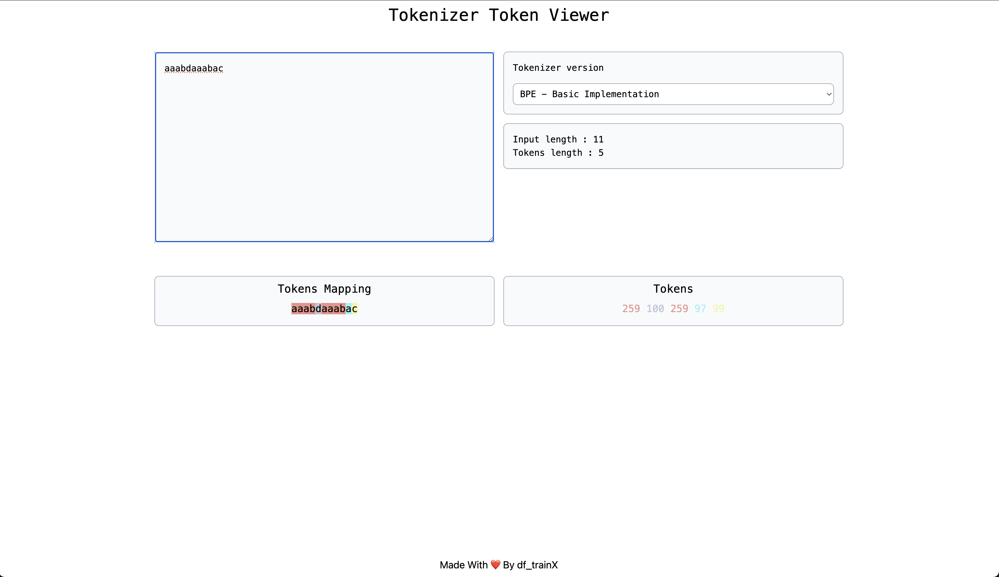

# Tokenizer Token Viewer

This repository houses an implementation of the Byte Pair Encoding (BPE) algorithm with several levels of optimization for tokenization. BPE is a data compression technique used primarily in natural language processing tasks such as text tokenization, where it helps in breaking down a given text into smaller subword units. By iteratively merging the most frequent pairs of characters or bytes, BPE efficiently builds a vocabulary that captures both common and rare words, thereby enhancing the performance of various NLP tasks like machine translation, language modeling, and text generation.

 - Basic BPE Implementation.
  